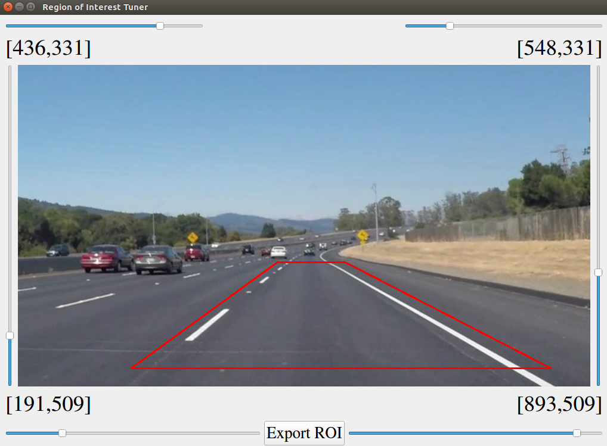

# **Finding Lane Lines on the Road** 
[](http://www.udacity.com/drive)

In this project we will detect lane lines in images using Python and [OpenCV](https://opencv.org/).  


## Overview

The software pipelione consists of the following stages to detect the lane lines:

- Extracting yellow and white colors from the image.
  
- Converting the image to gray scale.
  
- Smoothing the image using [_Gaussian filter_](https://en.wikipedia.org/wiki/Gaussian_filter).
  
- Applying [_Canny edge detection_](https://en.wikipedia.org/wiki/Canny_edge_detector) algorithm from OpenCV.
  
- Applying [_Hough transform_](https://en.wikipedia.org/wiki/Hough_transform) to find lines.

- Categorazing the detected lines to _left_ (positive slope) and _right_ (negative slope) lines.

- Finding one line for each class as the representative of that class using average of each line class.

- Drawing two lines (right and left) on the image. 

## Requirements

`python3` is used in this project along with the packages listed in `requirements.txt`. In order to install them, run the following command:

```$ pip install -r requirements.txt```

## Impelemetation
The core of this project is a class named `LineDetector`, existing in `core/LineDetector.py`. It can be used in two ways:

1- **Providing path to a video file to the class constructor**: in this case, using `process_video()` function, all the softwate pipeline will be applied to the video and the annotated video with the detected lines will be stored at `test_videos_output`. example:

```
ld = LineDetector('test_videos/challenge.mp4')
ld.process_video()
```

2- **No path for video file is provided**: The object can be used as a set of functions to apply each stage of the software pipeline on an arbitary image. example:

```
ld = LineDetector()
img = ld.read_image('test_images/solidWhiteRight.jpg')
white_yellows = ld.select_white_yellow(img)
gray = ld.convert_gray_scale(white_yellows)
smoothed =  ld.apply_smoothing(gray)
edges = ld.detect_edges(smoothed)
selected_region = ld.select_region(edges)
lines = hough_lines(selected_region)
...
```

## TODOs

In order to tunig the paramaters, inspired by [this article](https://medium.com/@maunesh/finding-the-right-parameters-for-your-computer-vision-algorithm-d55643b6f954), a GUI is depeloped base on `PyQt5` to select the coordinates of the `region of interest`. 




Due to lack of time, `` code is a **REAL MESS** now.

**TODO**: It should be cleaned and other paramters like:

- _Canny edge detection_
  
- _Guassian filter_, and 
  
- _Hough transform_ 
  
should be added to it.